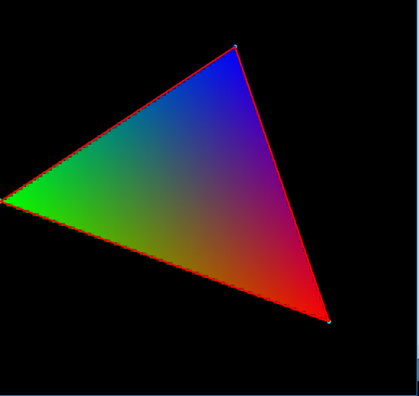

# Taller raster

## Propósito

Comprender algunos aspectos fundamentales del paradigma de rasterización.

## Tareas

Emplee coordenadas baricéntricas para:

1. Rasterizar un triángulo;
2. Implementar un algoritmo de anti-aliasing para sus aristas; y,
3. Hacer shading sobre su superficie.

Implemente la función ```triangleRaster()``` del sketch adjunto para tal efecto, requiere la librería [frames](https://github.com/VisualComputing/framesjs/releases).

## Integrantes

Máximo 3.

Complete la tabla:

| Integrante | github nick |
|------------|-------------|
|     Tania Paola Hurtado Pinto       |       TaniaHurtado      |
|Ivan Dario Rojas Florez| idrojasf |
|Miguel Ángel Ballén| mballeng91 |

## Discusión

Describa los resultados obtenidos. Qué técnicas de anti-aliasing y shading se exploraron? Adjunte las referencias. Discuta las dificultades encontradas.

Inicialmente, se utilizaron las fórmulas descritas en el paper asignado como lectura para la clase, con las cuales se calculó las funiones de los ejes, para hallar las coordenadas baricentricas y determinar si un punto estaba o no dentro del triángulo.
De esta forma, para cada uno de los pixeles que estaban dentro del triángulo se definió el peso baricéntrico, el cual se utilizó para asignar los colores a los subpixeles respectivos, para conseguir el efecto antialiasing y con esta variación de colores obtener el shading.

A continuación podemos observar una imagen de los resultados obtenidos.

- 

REFERENCIAS

https://www.scratchapixel.com/lessons/3d-basic-rendering/rasterization-practical-implementation/rasterization-practical-implementation
https://fgiesen.wordpress.com/2013/02/06/the-barycentric-conspirac/

DIFICULTADES

Calcular el incremento adecuado para colorear los subpixeles de tal forma que cubrieran la mayor parte del triángulo.


## Entrega

* Modo de entrega: [Fork](https://help.github.com/articles/fork-a-repo/) la plantilla en las cuentas de los integrantes (de las que se tomará una al azar).
* Plazo: 1/4/18 a las 24h.
